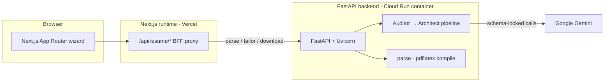

# Resume Builder

Upload a résumé, paste a target job description, and get back a rewritten one-page LaTeX résumé plus a before/after ATS read — reviewed as a git-style diff before you export the PDF. The hard part isn't calling an LLM; it's keeping a model honest enough to rewrite a résumé without inventing facts, forcing its output into a fixed schema, and turning that output into a PDF that actually compiles.

Next.js 16 (frontend + thin BFF) · FastAPI (Python) · Google Gemini · pdflatex · Playwright · Vercel + Cloud Run · *(personal project)*

> The frontend is a Next.js app; the real work — the two-stage AI pipeline and the LaTeX→PDF step — lives in a separate FastAPI backend. GitHub tags this repo TypeScript-only, but `backend/` is a full Python service.

## Contents

1. [What it does](#what-it-does)
2. [Architecture](#architecture)
3. [Where things live](#where-things-live)
4. [The tailoring pipeline](#the-tailoring-pipeline)
5. [Keeping the model on a schema](#keeping-the-model-on-a-schema)
6. [LaTeX → PDF](#latex--pdf)
7. [Invariants the system holds](#invariants-the-system-holds)
8. [Design decisions (and the alternatives I turned down)](#design-decisions-and-the-alternatives-i-turned-down)
9. [API & a worked example](#api--a-worked-example)
10. [Tests](#tests)
11. [Run it locally](#run-it-locally)
12. [Known limitations](#known-limitations)

---

## What it does

A four-step wizard — **upload → job → review → export**:

1. **Upload** a PDF or DOCX. The backend extracts the text and pulls hyperlinks out of PDF link annotations / DOCX bodies, since a résumé's links usually live in metadata, not the visible text.
2. **Paste the job description.** A two-stage Gemini pipeline first distills the JD to structured signal, then rewrites your résumé against it — returning tailored LaTeX plus a before/after ATS-style score.
3. **Review** the result as a side-by-side git-style diff of your original `.tex` against the tailored one. Regenerate if you don't like it.
4. **Export** — copy the LaTeX or download a compiled PDF.

Wizard state lives in a Zustand store persisted to `sessionStorage` (`resume-wizard-v1`), so a refresh mid-flow doesn't wipe your upload. Route guards (`hooks/use-wizard-guard.ts`) bounce you back if you land on `/resume/review` without having tailored anything.

The ATS numbers are **model-generated estimates** of keyword and structure fit against the pasted JD — not scores from any commercial ATS vendor.

## Architecture

Two services deployed independently. The browser only ever talks to the Next.js origin; Next validates each request and proxies it to the Python backend at `NEXT_PUBLIC_API_URL`, so the same client code targets a local FastAPI, staging, or the production Cloud Run URL without changing a route. There's **no database** — nothing is persisted server-side. The résumé text and tailored output live in the browser session and pass through the backend per request.



The frontend ships to Vercel; the backend ships as a Docker container to Cloud Run, because it needs a full TeX Live install to run `pdflatex` — which rules out a serverless function.

## Where things live

```
backend/app/
  main.py                       FastAPI app: CORS + /health; mounts the /api router
  api/v1/api.py                 router — mounts the resume endpoints under /api/resume
  api/v1/endpoints/resume.py    the 4 endpoints: parse · score · tailor · download
  models/resume.py              Pydantic response_schema models (RefinedJD, TailorResponseData,
                                ScoreResponseData) + request models + the {success,data,error} envelope
  core/config.py                settings: GEMINI_API_KEY, GEMINI_MODEL, asset paths
  core/prompts/personas.py      system-instruction strings (auditor vs recruiter roles)
  prompts/                      auditor.py · architect.py · scorer.py — the user prompts
  services/ai/
    orchestrator.py             TailorOrchestrator.run_pipeline — the two-stage flow
    auditor.py                  Stage 1: refine raw JD → RefinedJD
    architect.py                Stage 2: rewrite résumé → TailorResponseData
    scorer.py                   standalone /score (wired + hand-tested, unused by the frontend)
    client.py                   GeminiClient.call_genai — the one schema-locked call site
  services/document/
    parser.py                   PDF/DOCX text + hyperlink extraction
    pdf_compiler.py             pdflatex subprocess + sanitize_jobname + log trimming
    template.py                 loads the master LaTeX template
backend/assets/original-resume.tex   master LaTeX template the architect reuses verbatim
backend/main.py                 no-op shim (its top comment: exists only to trigger the deploy workflow)
backend/Dockerfile              TeX Live + uvicorn image for Cloud Run

app/                            Next.js App Router
  resume/{upload,job,review,export}/page.tsx   the 4 wizard steps
  api/resume/{parse,tailor,download}/route.ts  the thin BFF proxy (backend URL + prompts stay server-side)
store/wizard-store.ts           Zustand store, sessionStorage-persisted (resume-wizard-v1)
hooks/use-wizard-guard.ts       route guards for the wizard flow
e2e/
  specs/*.spec.ts               31 Playwright tests across 16 files
  helpers/api-mocks.ts          page.route stubs of /api/resume/* — every envelope shape the UI must survive
  mocks/ · fixtures/            canned tailor/parse payloads + sample résumé and JDs
.github/workflows/              e2e-playwright · deploy-frontend (E2E-gated) · deploy-backend (path-scoped)
```

If you only read two files, read `backend/app/services/ai/orchestrator.py` (the whole two-stage pipeline in ~30 lines) and `e2e/helpers/api-mocks.ts` (the contract the frontend is actually tested against).

## The tailoring pipeline

The `/tailor` call is not one prompt. `TailorOrchestrator.run_pipeline` (`services/ai/orchestrator.py`) runs two Gemini passes with different roles, because asking one prompt to both *understand* a messy job posting and *rewrite* a résumé against it produces worse output than splitting the two jobs:

- **Auditor** (`services/ai/auditor.py`) strips a raw posting down to a `RefinedJD`: title, company, location, must-have tech stack (explicitly *excluding* "nice to have" / "bonus" items), a seniority flag, core responsibilities, culture tags. This is the noise filter — everything downstream reasons over the digest, not the raw wall of text. The orchestrator formats that digest into a compact summary string.
- **Architect** (`services/ai/architect.py`) gets the digest, the full original résumé, and the master LaTeX template (`assets/original-resume.tex`), and returns a `TailorResponseData`: the rewritten `.tex` plus a dual before/after ATS assessment. The prompt (`prompts/architect.py`) hard-caps the output to one US-Letter page — at most 2 roles, 4 bullets each, 3 projects, 6 skill lines — reuses the template's macros verbatim, and repeats one rule everywhere: **use only facts from the résumé.** No invented employers, dates, tools, or metrics; a required skill with no résumé evidence becomes a *gap* in `suggestions`, never a fabricated bullet.

The orchestrator injects the `refined_jd` back into the result so the UI can show what the JD was distilled to, then returns.

There's a third role — a standalone **scorer** (`services/ai/scorer.py`, backend `/score` endpoint) that scores one résumé against one JD on the same rubric. It's wired and hand-tested but the frontend doesn't call it: the tailor pass already returns a before/after comparison, so `/score` is currently unused surface. Likewise `CompareRequest` / `CompareResponseData` exist as models with no endpoint behind them — leftover scaffolding, noted here rather than hidden.

## Keeping the model on a schema

Every Gemini call goes through one place — `GeminiClient.call_genai` (`services/ai/client.py`) — and every call is pinned to a Pydantic model:

```python
config=types.GenerateContentConfig(
    system_instruction=system_instruction,
    temperature=0.0, top_p=1.0, top_k=1,      # as deterministic as Gemini gets
    max_output_tokens=16384,
    response_mime_type="application/json",
    response_schema=schema,                    # RefinedJD / TailorResponseData / ScoreResponseData
    safety_settings=[... all BLOCK_NONE],
)
```

Temperature 0 (plus `top_k=1`) because résumé tailoring should be repeatable, not creative — the same résumé and JD should yield the same rewrite. The `response_schema` forces Gemini to emit JSON matching the Pydantic model, so the auditor can't hand back prose where the architect expects a `core_tech_stack` list. The client still defensively strips stray ```` ``` ```` fences and raises a typed `RuntimeError` on empty or unparseable output — "schema-locked" is a strong hint about *shape*, not a guarantee about *truthfulness* (the "only facts from the résumé" rule is enforced by the prompt, not the schema; see limitations).

Safety thresholds are `BLOCK_NONE` across every category — the comment says it's to stop Gemini truncating technical content mid-response. That's a deliberate trade-off, not a safe default. See limitations.

## LaTeX → PDF

`/download` compiles user-supplied LaTeX to a real PDF via a `pdflatex` subprocess (`services/document/pdf_compiler.py`). It tries the `pdflatex` Python wrapper first, then falls back to invoking the binary directly:

```
pdflatex -interaction=nonstopmode -halt-on-error -output-directory=<tmp> -jobname=<name> <file>.tex
```

Everything runs in a `TemporaryDirectory` with a **30-second timeout**. On failure it doesn't just 500 blindly — it trims the last 3000 chars of the pdflatex log (where the actual error is) into the error response's `details`, so a broken `.tex` tells you *why* it broke. Filenames are sanitized by `sanitize_jobname` to a safe `Candidate+Company+Role+Location` shape before they touch the shell. This is the reason the backend is a container: it needs `texlive-latex-*` packages installed (see `backend/Dockerfile`), which a serverless runtime can't provide.

## Invariants the system holds

These hold no matter what input arrives — each is enforced somewhere specific, and a couple are honestly softer than the rest:

| Invariant | Enforced by |
|---|---|
| Every AI response is JSON matching its declared schema, **or the call fails loudly** — never free text flowing downstream | `response_schema` on `call_genai`; empty/unparseable output raises `RuntimeError` |
| Same résumé + same JD → the same rewrite (repeatable, not creative) | `temperature=0.0`, `top_p=1.0`, `top_k=1` |
| The user **reviews a git-style diff before anything is exported** | wizard order (review precedes export) + `use-wizard-guard.ts` blocks `/resume/review` with no tailored data |
| A commit deploys to Vercel **only after its OWN E2E run is green** | `deploy-frontend.yml` `workflow_run` gate, keyed on `github.event.workflow_run.head_sha` (same SHA) |
| Tailored output stays within one US-Letter page: ≤2 roles, ≤4 bullets/role, ≤3 projects, ≤6 skill lines | architect prompt hard caps (`prompts/architect.py`) |
| PDF compilation can't hang the request | 30-second subprocess timeout inside a `TemporaryDirectory` |
| The backend URL and the prompts never reach the browser | prompts live in Python only; `NEXT_PUBLIC_API_URL` is read server-side in the route handlers |
| Tailored résumé uses **only facts from the original** (a missing skill → a gap, not a fabricated bullet) | architect prompt — *model behavior, a soft guarantee, not code-enforced; see limitations* |

## Design decisions (and the alternatives I turned down)

- **Decoupled Next.js BFF → FastAPI, not one Next.js app.** The LLM pipeline and a real LaTeX compile belong in Python — `pdflatex` needs a full TeX Live install, which a Vercel serverless function can't carry. So the browser talks only to Next (which validates and proxies), and the heavy, container-bound work lives behind it on Cloud Run. Two deploy targets is more moving parts than one app; it's the price of running a real compiler.
- **Schema-locked Gemini at temperature 0, not parsing free text.** Every call declares a Pydantic `response_schema` and runs at temp 0. The alternative — prompt for prose, then regex/parse it — is exactly the brittleness this avoids: the auditor returns a typed `RefinedJD` the architect can consume directly, and a malformed response fails loudly instead of silently feeding garbage downstream.
- **Playwright stubs the app's OWN `/api/resume/*` routes, not the Gemini SDK or the live model.** Tests mock at the network edge with `page.route` (`e2e/helpers/api-mocks.ts`). Mocking the Gemini client would test my mock; hitting the live model would make CI slow, paid, and flaky. Stubbing the app's own routes tests *the app* — every envelope shape the wizard must survive — independently of whether the model is having a good day.
- **A real `pdflatex` subprocess, not an HTML-to-PDF library.** The résumés are authored in LaTeX and the template's macros are the point; rendering them through Puppeteer/HTML would mean re-implementing the layout and losing typographic control. The cost is a heavyweight container and a shell-out — accepted, and fenced with a timeout, a temp dir, and filename sanitization.
- **Two-stage auditor → architect, not one mega-prompt.** Splitting "understand the JD" from "rewrite the résumé" gives each pass a single job and a clean schema. One prompt doing both produced noticeably worse rewrites in practice.

## API & a worked example

Backend endpoints live under `/api/resume/` (plus a `/health` liveness check); OpenAPI docs are at `/docs` when the server runs. Everything speaks one `{ success, data?, error? }` envelope, so the client has a single response shape to handle.

| Method | Backend route | Purpose | BFF proxy job (beyond forwarding) |
|---|---|---|---|
| `POST` | `/api/resume/parse` | PDF/DOCX → text + links | rejects non-`File` uploads; re-wraps the multipart body |
| `POST` | `/api/resume/tailor` | run the two-stage pipeline | validates `jd` (≥40 chars) + `resume_text`; maps `snake_case` → `camelCase` |
| `POST` | `/api/resume/download` | LaTeX → compiled PDF | passes JSON errors through; streams the PDF `arrayBuffer` with the backend's `Content-Disposition` |
| `POST` | `/api/resume/score` | standalone ATS score | *(no proxy route — frontend doesn't call it)* |

A tailor response (shape taken from the E2E fixtures — illustrative, not a benchmark):

```jsonc
POST /api/resume/tailor
{ "resume_text": "…", "jd": "Software Engineer, Web at Google — React, TypeScript, distributed systems…" }

→ { "success": true, "data": {
     "candidateName": "Saurav Kumar",
     "targetCompany": "Google", "targetRole": "Software Engineer Web", "targetLocation": "Bengaluru",
     "tailoredTex": "\\documentclass{article}…",
     "atsScores": {
       "original": { "score": 69, "band": "Moderate fit", "rationale": "…needs stronger architecture articulation." },
       "tailored": { "score": 88, "band": "Strong fit",   "rationale": "Clearer technical depth and outcomes." },
       "liftSummary": "Score improved with better Google-aligned engineering framing."
     },
     "suggestions": ["Add architecture tradeoff decision detail.", "Include a complex-debugging example."]
} }
```

The UI renders `tailoredTex` against the original as a diff, shows the before/after scores, and only then allows export. Errors are the same envelope with `success:false`: `INVALID_JD` / `INVALID_RESUME` (proxy validation, 400), `TAILOR_FAILED` / `PARSE_FAILED` (backend, 500), `PDF_COMPILE_FAILED` (with the trimmed pdflatex log in `details`).

## Tests

**31 Playwright tests across 16 spec files — frontend only.** They mock the app's *own* `/api/resume/*` routes at the network edge (`e2e/helpers/api-mocks.ts`), not Gemini's endpoint, so CI never depends on a live model or a running backend. What they pin down is the wizard's handling of every envelope shape: happy path, guard redirects, session persistence, multi-JD regression, and the ugly cases — HTTP 200 with `success:false`, non-JSON bodies, download errors, upload edge cases.

```bash
npm run e2e            # headless; boots its own dev server unless PLAYWRIGHT_BASE_URL is set
npm run e2e:ui         # interactive
npm run e2e:report     # open the last HTML report
```

The frontend Vercel deploy is gated on a green E2E run of the **same commit SHA** (`deploy-frontend.yml` triggers on `workflow_run` after "E2E Playwright" succeeds on `main`, then re-checks the SHA and the changed paths).

The FastAPI backend has **no automated tests** — see limitations for the order I'd add them.

## Run it locally

You need Node 20+, Python 3.12+, and a `pdflatex` (TeX Live / MacTeX) on your PATH for local PDF export — or just run the backend via its Docker image, which bundles TeX Live.

**Backend:**

```bash
cd backend
python -m venv venv && source venv/bin/activate   # Windows: venv\Scripts\activate
pip install -r requirements.txt
export GEMINI_API_KEY="…"                          # optional: GEMINI_MODEL, default gemini-1.5-flash
uvicorn app.main:app --reload --port 8000          # docs at http://127.0.0.1:8000/docs
```

**Frontend** (second terminal):

```bash
npm install
echo 'NEXT_PUBLIC_API_URL=http://127.0.0.1:8000' > .env.local
npm run dev                                        # http://localhost:3000 → /resume/upload
```

## Known limitations

Flagged, not defended — the candour is the point:

- **The FastAPI backend has zero automated tests.** All 31 are frontend Playwright. First thing I'd add: unit tests around `sanitize_jobname` and the pdflatex fallback (pure, edge-case-heavy), then a contract test per endpoint with a stubbed Gemini client.
- **CORS is wide open** — `allow_origins=["*"]` *with* `allow_credentials=True`. Fine for a solo project with no auth; not something to copy anywhere real. Security is not a selling point of this repo.
- **Gemini safety is `BLOCK_NONE`** on every category — a pragmatic call to avoid truncated code output, but the opposite of a safe default.
- **"Only facts from the résumé" is enforced by the prompt, not by code.** The schema constrains structure, not truthfulness; a determined hallucination isn't mechanically blocked. That's why a human diff review sits before export.
- **Dead code, left visible on purpose:** `puppeteer` is still a dependency and `next.config.ts` keeps it as a `serverExternalPackages` external, but nothing imports it (a scraping idea that didn't ship); `backend/main.py` is a no-op shim that exists to trigger the deploy workflow; `services/ai/client.py` / `scorer.py` carry `Broadway_client` / `Broadway_scorer` aliases nothing uses; `/score` and `CompareRequest`/`CompareResponseData` are wired-but-unused surface.
- **No auth, no rate limiting, no persistence.** Generation is open; a real deployment needs a limiter in front of the Gemini call. There's no history because there's no database — deliberate for an MVP.
- **`GEMINI_API_KEY` isn't validated at startup** — a missing key surfaces as a runtime error on the first AI call, not a clean boot failure. AI-client logging is `print()`, not the `logging` module the endpoints use.
```
