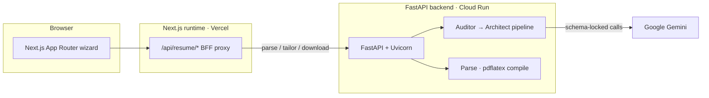
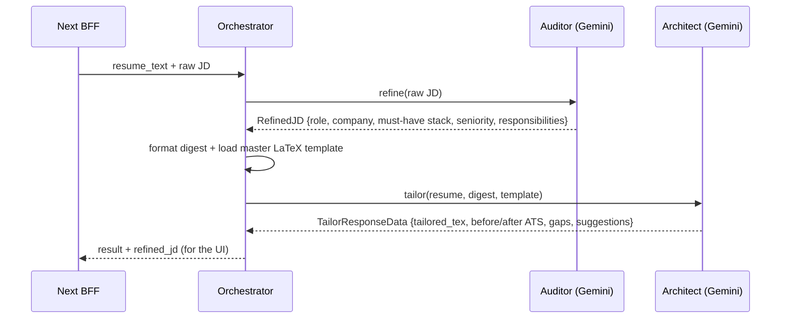

# Resume Builder

Upload a résumé, paste a target job description, and get back a rewritten one-page LaTeX résumé plus a before/after ATS read — reviewed as a git-style diff before you export the PDF. The hard part isn't calling an LLM; it's keeping a model honest enough to rewrite a résumé without inventing facts, and turning its output into a PDF that actually compiles.

Next.js 16 (frontend + thin BFF) · FastAPI (Python) · Google Gemini · pdflatex · Playwright · Vercel + Cloud Run

> Personal project. The frontend is a Next.js app; the real work — the AI pipeline and the LaTeX→PDF step — lives in a separate FastAPI backend. GitHub tags this repo TypeScript-only, but `backend/` is a full Python service.

---

## Contents

1. [What it does](#what-it-does)
2. [Architecture](#architecture)
3. [The tailoring pipeline](#the-tailoring-pipeline)
4. [Keeping the model on a schema](#keeping-the-model-on-a-schema)
5. [LaTeX → PDF](#latex--pdf)
6. [The BFF proxy](#the-bff-proxy)
7. [Tests & honest limitations](#tests--honest-limitations)
8. [Run it locally](#run-it-locally)
9. [Tech stack](#tech-stack)

---

## What it does

A four-step wizard — **upload → job → review → export**:

1. **Upload** a PDF or DOCX. The backend extracts the text (and pulls hyperlinks out of PDF annotations / DOCX bodies, since a résumé's links usually live in metadata, not the visible text).
2. **Paste the job description.** A two-stage Gemini pipeline first distills the JD to structured signal, then rewrites your résumé against it — returning tailored LaTeX plus a before/after ATS-style score.
3. **Review** the result as a side-by-side git-style diff of your original `.tex` against the tailored one. Regenerate if you don't like it.
4. **Export** — copy the LaTeX or download a compiled PDF.

Wizard state lives in a Zustand store persisted to `sessionStorage` (`resume-wizard-v1`), so a refresh mid-flow doesn't wipe your upload. Route guards (`hooks/use-wizard-guard.ts`) bounce you back if you land on `/resume/review` without having tailored anything.

The ATS numbers are **model-generated estimates** of keyword and structure fit against the pasted JD — not scores from any commercial ATS vendor.

---

## Architecture

The browser only ever talks to the Next.js origin. Next validates each request and proxies it to the Python backend at `NEXT_PUBLIC_API_URL`, so the same client code targets a local FastAPI, staging, or the production Cloud Run URL without changing a route.



Two deployment targets, deployed independently: the **frontend** on Vercel, the **backend** as a Docker container on Cloud Run (it needs a full TeX Live install to run `pdflatex`, which rules out a serverless function). There's no database — nothing is persisted server-side; the résumé text and tailored output live in the browser session and pass through the backend per request.

---

## The tailoring pipeline

The `/tailor` call is not one prompt. `TailorOrchestrator.run_pipeline` (`backend/app/services/ai/orchestrator.py`) runs two Gemini passes with different roles, because asking one prompt to both *understand* a messy job posting and *rewrite* a résumé against it produces worse output than splitting the two jobs:



- **Auditor** (`services/ai/auditor.py`) strips a raw posting down to a `RefinedJD`: title, company, must-have tech stack (explicitly *excluding* "nice to have" / "bonus" items), seniority signal, core responsibilities, culture tags. This is the noise filter — everything downstream reasons over the digest, not the raw wall of text.
- **Architect** (`services/ai/architect.py`) gets the digest, the full original résumé, and a master LaTeX template (`assets/original-resume.tex`), and returns the rewritten `.tex` plus a dual before/after ATS assessment. The prompt (`prompts/architect.py`) hard-caps the output to one US-Letter page — at most 2 roles, 4 bullets each, 3 projects, 6 skill lines — reuses the template's macros verbatim, and repeats one rule everywhere: **use only facts from the résumé.** No invented employers, dates, tools, or metrics; a required skill with no résumé evidence becomes a *gap* in `suggestions`, never a fabricated bullet.

There's a third role — a standalone **scorer** (`services/ai/scorer.py`, backend `/score` endpoint) that scores one résumé against one JD on the same rubric the architect uses. It's wired and tested-by-hand but the frontend doesn't call it today: the tailor pass already returns a before/after comparison, so `/score` is currently unused surface. Likewise `CompareRequest`/`CompareResponseData` exist as models with no endpoint behind them — leftover scaffolding, noted here rather than hidden.

---

## Keeping the model on a schema

Every Gemini call goes through one place — `GeminiClient.call_genai` (`services/ai/client.py`) — and every call is pinned to a Pydantic model:

```python
config=types.GenerateContentConfig(
    system_instruction=system_instruction,
    temperature=0.0, top_p=1.0, top_k=1,      # deterministic as Gemini gets
    max_output_tokens=16384,
    response_mime_type="application/json",
    response_schema=schema,                    # RefinedJD / TailorResponseData / ScoreResponseData
    safety_settings=[... all BLOCK_NONE],
)
```

Temperature 0 (plus `top_k=1`) because résumé tailoring should be repeatable, not creative — the same résumé and JD should yield the same rewrite. The `response_schema` forces Gemini to emit JSON matching a Pydantic model, so the auditor can't return prose where the architect expects a `core_tech_stack` list. The client still defensively strips stray ```` ``` ```` fences and raises a typed `RuntimeError` on empty/unparseable output, because "schema-locked" is a strong hint, not a hard guarantee.

Safety thresholds are set to `BLOCK_NONE` across all categories — the comment says it's to stop Gemini truncating technical content mid-response — which is a deliberate trade-off, not a safe default. See limitations.

---

## LaTeX → PDF

`/download` compiles user-supplied LaTeX to a real PDF via a `pdflatex` subprocess (`services/document/pdf_compiler.py`). It tries the `pdflatex` Python wrapper first, then falls back to invoking the binary directly:

```
pdflatex -interaction=nonstopmode -halt-on-error -output-directory=<tmp> -jobname=<name> <file>.tex
```

Everything runs in a `TemporaryDirectory` with a **30-second timeout**. On failure it doesn't just 500 — it trims the last 3000 chars of the pdflatex log (where the actual error is) into the error response, so a broken `.tex` tells you *why* it broke. Filenames are sanitized to a safe `Candidate+Company+Role+Location` shape before they touch the shell. This is the reason the backend is a container: it needs `texlive-latex-*` packages installed (see `backend/Dockerfile`), which a serverless runtime can't provide.

---

## The BFF proxy

The three `app/api/resume/*` routes are thin proxies with one real job each beyond forwarding:

| Method | Route | Beyond forwarding |
| ------ | ----- | ----------------- |
| `POST` | `/api/resume/parse` | Rejects non-`File` uploads before hitting the backend; re-wraps the multipart body. |
| `POST` | `/api/resume/tailor` | Validates `jd` (≥40 chars) and `resume_text`; maps backend `snake_case` → frontend `camelCase` (`tailored_tex → tailoredTex`, etc.). |
| `POST` | `/api/resume/download` | Passes JSON errors straight through but streams the PDF `arrayBuffer` with the backend's `Content-Disposition`. |

The backend URL (`NEXT_PUBLIC_API_URL`) never reaches the browser, and neither do the prompts — they live in Python only. Both the proxy and the FastAPI endpoints speak the same `{ success, data?, error? }` envelope, so the client has one response shape to handle.

The backend endpoints live under `/api/resume/`: `parse`, `score`, `tailor`, `download`, plus a `/health` liveness check. OpenAPI docs are at `/docs` when the server is running.

---

## Tests & honest limitations

**31 Playwright tests, 16 spec files, frontend only.** They mock the app's *own* `/api/resume/*` routes at the network edge with `page.route` (`e2e/helpers/api-mocks.ts`) — not Gemini's endpoint — so CI never depends on a live model or a running backend. What they actually pin down is the wizard's handling of every envelope shape: happy path, guard redirects, session persistence, multi-JD regression, and the ugly cases — HTTP 200 with `success:false`, non-JSON bodies, download errors, upload edge cases. The frontend Vercel deploy is **gated on a green E2E run of the same commit SHA** (`deploy-frontend.yml` triggers on `workflow_run` after "E2E Playwright" succeeds on `main`).

Known limitations, plainly:

- **The FastAPI backend has zero automated tests.** All 31 tests are frontend. The backend is exercised only by hand and by the wizard in dev. First thing I'd add: unit tests around `sanitize_jobname` and the pdflatex fallback (pure, edge-case-heavy), then a contract test per endpoint with a stubbed Gemini client.
- **CORS is wide open** — `allow_origins=["*"]` *with* `allow_credentials=True`. Fine for a solo project with no auth, not something to copy into anything real.
- **Gemini safety is `BLOCK_NONE`** on every category. A pragmatic call to avoid truncated code output, but it's the opposite of a safe default — flagging it, not defending it. Security is not a selling point of this repo.
- **Dead code, left visible on purpose:** `puppeteer` is still a dependency and `next.config.ts` keeps it as a `serverExternalPackages` external, but nothing in the source imports it (a scraping idea that didn't ship). `backend/main.py` is a no-op shim whose top comment admits it exists to trigger the deploy workflow — the real entrypoint is `backend/app/main.py`. `services/ai/client.py` carries `Broadway_client`/`Broadway_scorer` aliases that nothing uses.
- **No auth, no rate limiting, no persistence.** Generation is open; a real deployment needs a limiter in front of the Gemini call. There's no history because there's no database — deliberate for an MVP.
- **`GEMINI_API_KEY` isn't validated at startup** — a missing key surfaces as a runtime error on the first AI call, not a clean boot failure.
- **AI-client logging is `print()`**, not the `logging` module the endpoints use.

---

## Run it locally

You need Node 20+, Python 3.12+, and a `pdflatex` (TeX Live / MacTeX) on your PATH for local PDF export — or just run the backend via its Docker image, which bundles TeX Live.

**Backend:**

```bash
cd backend
python -m venv venv && source venv/bin/activate   # Windows: venv\Scripts\activate
pip install -r requirements.txt
export GEMINI_API_KEY="…"                          # optional: GEMINI_MODEL, default gemini-1.5-flash
uvicorn app.main:app --reload --port 8000          # docs at http://127.0.0.1:8000/docs
```

**Frontend** (in a second terminal):

```bash
npm install
echo 'NEXT_PUBLIC_API_URL=http://127.0.0.1:8000' > .env.local
npm run dev                                        # http://localhost:3000 → /resume/upload
```

**Tests:**

```bash
npm run e2e            # headless; boots its own dev server unless PLAYWRIGHT_BASE_URL is set
npm run e2e:ui         # interactive
npm run e2e:report     # open the last HTML report
```

---

## Tech stack

**Frontend** Next.js 16 (App Router) · React 19 · TypeScript 5 · Tailwind CSS 4 · shadcn/ui (Radix) · Zustand (sessionStorage-persisted) · react-diff-viewer-continued

**Backend** Python 3.12 · FastAPI · Uvicorn · Pydantic v2 · pdfminer.six + python-docx (extraction) · pdflatex subprocess (PDF)

**AI** Google Gemini via `google-genai` — two-stage auditor→architect pipeline, Pydantic `response_schema`, temperature 0

**Tooling & delivery** Playwright (31 E2E, route-mocked) · GitHub Actions · Vercel (frontend, E2E-gated) · Docker + Cloud Run (backend, path-scoped deploy)
