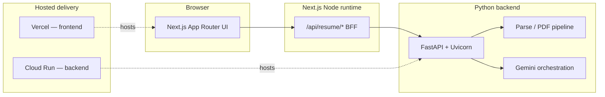

# Resume Builder

**End-to-end resume tailoring platform** — users upload a résumé (PDF/DOCX), paste a target job description, and receive **LLM-assisted** LaTeX-aligned output with **diff-style review**, **ATS-oriented signals**, and **exportable artifacts** (LaTeX + PDF). The system is built as a **decoupled full stack**: a **Next.js** client and BFF, a **FastAPI** services tier for document and AI workloads, **Google Gemini** for generation and scoring, **automated browser testing**, and **CI/CD** across **Vercel** (frontend) and **Google Cloud Run** (backend).

This repository is intentionally **full lifecycle**: **frontend engineering**, **backend services**, **prompt / schema–driven AI**, **quality gates**, and **deployment automation** live in one place so the product can evolve without silos.

---

## Table of contents

1. [What we built](#what-we-built)
2. [High-level architecture](#high-level-architecture)
3. [Technology stack](#technology-stack)
4. [Repository layout](#repository-layout)
5. [Prerequisites](#prerequisites)
6. [Local development](#local-development)
7. [Environment variables](#environment-variables)
8. [API surface (BFF)](#api-surface-bff)
9. [Testing & quality](#testing--quality)
10. [DevOps & delivery](#devops--delivery)
11. [Documentation](#documentation)

---

## What we built

| Area | Delivery |
| ---- | -------- |
| **Product UX** | Multi-step wizard: **upload → job (JD) → review → export**, with stepper, guards, and **session-persisted** wizard state. |
| **Frontend** | **React 19** + **Next.js 16** (App Router), **TypeScript**, **Tailwind CSS 4**, **shadcn/ui** (Radix primitives), **Zustand** persistence, accessible forms and diff-centric review. |
| **Backend** | **FastAPI** micro-endpoints for **parse**, **tailor**, **compare/score**, **download (LaTeX → PDF)**; **Pydantic** contracts; **Docker**-ready service for Cloud Run. |
| **AI** | **Google Gemini** via **`google-genai`** on the backend, structured outputs and **prompt engineering** (semantic tagging, JSON/schema discipline). |
| **Documents** | **pdfminer.six**, **python-docx** extraction; **pdflatex** pipeline for PDF export inside containerized backend. |
| **Testing** | **Playwright** E2E suite with **route interception**, fixtures, and **API contract** scenarios for the wizard (30+ scenarios). |
| **DevOps** | **GitHub Actions**: install → **E2E on `main`** → **gated frontend deploy**; **path-scoped backend deploy**; artifacts for failure analysis. |

---

## High-level architecture

The browser talks only to the **Next.js origin**. Next **validates** requests and **proxies** to the Python API using a configurable base URL — so one codebase can target **local FastAPI**, **staging**, or **production Cloud Run** without changing client routes.



**Routing recap**

| Step | Route | Responsibility |
| ---- | ----- | ---------------- |
| Upload | `/resume/upload` | File → parse proxy → stored text |
| Job | `/resume/job` | JD + resume text → tailor proxy → structured result |
| Review | `/resume/review` | Diff, analytics, edit/regenerate flows |
| Export | `/resume/export` | LaTeX copy + PDF download proxy |

**`/`** redirects to **`/resume/upload`**. Canonical path constants: **`config/routes.ts`**.

---

## Technology stack

Below is the **stack we actually ship and operate** in this repo — grouped by discipline so it reads as a deliberate **full stack + AI + QA + DevOps** investment.

### Frontend & UI platform

| Technology | Role in this project |
| ---------- | -------------------- |
| **Next.js 16** | App Router, RSC-capable layout, server routes for BFF, production builds. |
| **React 19** | Component model, concurrent-ready UI. |
| **TypeScript 5** | End-to-end typing for routes, stores, and API envelopes. |
| **Tailwind CSS 4** | Utility-first styling, design tokens via CSS variables. |
| **shadcn/ui** (`components.json`: radix-nova) | Composed primitives (Button, Card, Tabs, Alert, etc.) in `components/ui/`. |
| **Radix UI** | Accessible primitives beneath shadcn patterns. |
| **lucide-react** | Icon set aligned with shadcn defaults. |
| **Zustand** | Wizard state + **`sessionStorage`** persistence (`store/wizard-store.ts`). |
| **react-diff-viewer-continued** | Side-by-side / unified diff for review. |
| **`diff`** | Supporting diff utilities where needed. |
| **CVA + clsx + tailwind-merge** | Variant styling and class composition (`class-variance-authority`, etc.). |

### Backend & services

| Technology | Role in this project |
| ---------- | -------------------- |
| **Python 3.12+** | Backend runtime (see `backend/README.md` for PDF/LaTeX host deps). |
| **FastAPI** | HTTP API, automatic OpenAPI at `/docs`. |
| **Uvicorn** | ASGI server for local and container entry. |
| **Pydantic v2** | Request/response validation and structured AI outputs. |
| **pdfminer.six** | PDF text extraction. |
| **python-docx** | DOCX text extraction. |
| **pdflatex** (system + **`pdflatex`** Python wrapper) | LaTeX → PDF for `/api/resume/download`. |
| **Docker** | **Backend image** for reproducible PDF toolchain (`backend/Dockerfile`). |

### Artificial intelligence & prompts

| Technology | Role in this project |
| ---------- | -------------------- |
| **Google Gemini** | Primary LLM for tailoring, scoring, comparison, and related flows. |
| **`google-genai` (Python)** | Official Gen AI client; typed calls and schema-backed responses in `backend/app/services/ai/`. |
| **Structured output / schemas** | Reduces drift; enforced at the service layer with Pydantic. |
| **Prompt design** | Semantic XML-style tagging and system instructions (see backend prompt modules). |
| **Next.js → FastAPI proxy** | Tailor / parse / download calls go through `app/api/resume/*` to the Python backend; prompts live server-side only. |

### Quality engineering & testing

| Technology | Role in this project |
| ---------- | -------------------- |
| **Playwright** | Cross-browser E2E automation (`@playwright/test`). |
| **Chromium (CI)** | `npx playwright install --with-deps chromium` in GitHub Actions. |
| **Route mocking** | `page.route` on `/api/resume/*` for deterministic envelopes, errors, and edge cases (`e2e/helpers/api-mocks.ts`). |
| **Fixtures & mocks** | `e2e/fixtures/`, `e2e/mocks/` — JD corpora, LaTeX base file, JSON API payloads. |
| **ESLint 9 + eslint-config-next** | Static analysis for the TypeScript/React codebase. |

### DevOps, delivery & platform

| Technology | Role in this project |
| ---------- | -------------------- |
| **GitHub Actions** | CI workflows in `.github/workflows/`. |
| **Vercel CLI** | Production build + **`vercel deploy --prebuilt`** for the Next app (`deploy-frontend.yml`). |
| **Google Cloud Run** | Managed container hosting for the FastAPI backend (`deploy-backend.yml`). |
| **Google Cloud SDK + Docker** | Build, push, and deploy backend images to Artifact Registry / Cloud Run. |
| **`workflow_run` orchestration** | **Frontend** deploy runs only after the **E2E Playwright** workflow **succeeds** on `main`, using the **same commit SHA** as the green test run. |
| **Path-scoped deploys** | Backend deploy triggers only when `backend/**` (or the backend workflow file) changes — decoupled from Playwright because E2E does not execute Python integration tests today. |

### Design & product documentation

| Artifact | Purpose |
| -------- | ------- |
| **`design.md` / `design-pattern.md`** | Visual and composition standards for UI work. |
| **`components/wizard/README.md`** | Route-level behaviour, guards, data flow, and **E2E spec index** for the wizard. |
| **`AGENTS.md`** | Contributor and agent conventions for this repo. |

---

## Repository layout

| Path | Contents |
| ---- | -------- |
| **`app/`** | App Router pages, layouts, and **`app/api/resume/*`** BFF routes. |
| **`components/`** | Feature UI (`wizard/`, `resume-tailor/`) and **`components/ui/`** (shadcn). |
| **`config/`** | Routes, wizard steps, UI constants. |
| **`store/`** | Zustand wizard store. |
| **`hooks/`** | Client hooks (e.g. wizard guard). |
| **`lib/`**, **`types/`**, **`prompts/`** | Shared utilities, shared types, TS-side prompt helpers. |
| **`e2e/`** | Playwright **specs**, **helpers**, **fixtures**, **mocks**; `playwright.config.ts` at repo root. |
| **`backend/`** | FastAPI app, services, Dockerfile, `requirements.txt`. |
| **`public/`** | Static assets including **`original-resume.tex`**. |
| **`.github/workflows/`** | `e2e-playwright.yml`, `deploy-frontend.yml`, `deploy-backend.yml`. |

---

## Prerequisites

- **Node.js 20+** and **npm** (see `package.json` → `engines`).
- **Python 3.12+** and **pip** when running or packaging the backend.
- For **local PDF export**: a LaTeX distribution providing **`pdflatex`**, or use **`backend`** Docker image (see `backend/README.md`).
- **Google Gemini API key** on the backend for live AI routes.

---

## Local development

### Frontend (Next.js)

```bash
npm install
npm run dev
# http://localhost:3000 → redirects to /resume/upload
```

### Backend (FastAPI)

```bash
cd backend
python -m venv venv && source venv/bin/activate   # Windows: venv\Scripts\activate
pip install -r requirements.txt
export GEMINI_API_KEY="…"
uvicorn main:app --reload --port 8000
# API docs: http://127.0.0.1:8000/docs
```

Point the Next BFF at the backend:

```bash
# .env.local
NEXT_PUBLIC_API_URL=http://127.0.0.1:8000
```

### Full-stack smoke

With **both** processes running, use the wizard in the browser; `/api/resume/*` calls will proxy to FastAPI.

### End-to-end tests (Playwright)

```bash
npm run e2e          # headless; starts dev server unless PLAYWRIGHT_BASE_URL is set
npm run e2e:ui       # interactive UI mode
npm run e2e:headed   # headed browser
npm run e2e:report   # open last HTML report
```

---

## Environment variables

### Next.js (`.env.local` — see also `.env.example`)

| Variable | Purpose |
| -------- | ------- |
| **`NEXT_PUBLIC_API_URL`** | Base URL for FastAPI (e.g. `http://127.0.0.1:8000` locally, Cloud Run URL in production). |

### Backend (`backend/.env` or shell exports — see `backend/.env.example`)

| Variable | Purpose |
| -------- | ------- |
| **`GEMINI_API_KEY`** | Required for Gemini-backed endpoints. |
| **`GEMINI_MODEL`** | Optional model override (default varies by service config; see `backend/README.md`). |

---

## API surface (BFF)

Browser and server components call **same-origin** routes; Next forwards to **`NEXT_PUBLIC_API_URL`**.

| Method | Path | Role |
| ------ | ---- | ---- |
| `POST` | `/api/resume/parse` | Multipart file → backend parse |
| `POST` | `/api/resume/tailor` | JSON `{ jd, resume_text }` → backend tailor |
| `POST` | `/api/resume/download` | JSON `{ latex, filename }` → backend PDF stream |

Additional **FastAPI** endpoints (e.g. score, compare) are documented under **`backend/README.md`** and OpenAPI **`/docs`** when the server is running.

---

## Testing & quality

- **Primary gate:** Playwright **user-journey** tests under **`e2e/specs/`**, covering happy paths, **navigation**, **session persistence**, **guard redirects**, **tailor/upload error contracts**, **loading states**, **multi-JD regression** with fixtures, and **export** behaviour (download + clipboard).
- **Determinism:** Most tests **mock** `/api/resume/*` in the browser so CI does **not** depend on Gemini or a live backend — they validate **UI + client-side handling** of success and failure envelopes.
- **When to add tests:** Any new wizard step or API contract change should extend **`e2e/`** and update **`components/wizard/README.md`**.

---

## DevOps & delivery

| Workflow | Trigger | Behaviour |
| -------- | ------- | ----------- |
| **`e2e-playwright.yml`** | Push to **`main`** (and **manual** dispatch) | `npm ci` → Playwright Chromium → **`npm run e2e`** → upload **HTML report** artifact (retained days). |
| **`deploy-frontend.yml`** | **`workflow_run`** after **E2E Playwright** **success** on `main`, plus **`workflow_dispatch`** | Checks out **triggering `head_sha`**, skips **backend-only** commits (same intent as historical `paths-ignore`), then **Vercel** production build + deploy. |
| **`deploy-backend.yml`** | Push to **`main`** with changes under **`backend/**`** or the workflow file | **Docker build/push** + **Cloud Run deploy** — **not** blocked on Playwright (E2E does not cover Python today). |

**Operational note:** If **Vercel Git** is also connected for automatic production deploys on push, you may still see **parallel** deploy paths; align Vercel project settings with this Actions-based flow if you want a **single** production promotion story.

---

## Documentation

| Document | Audience |
| -------- | -------- |
| **[`README.md`](README.md)** (this file) | Engineers and operators — stack, architecture, CI, local setup. |
| **[`components/wizard/README.md`](components/wizard/README.md)** | Feature owners — routes, guards, data flow, **E2E map**. |
| **[`backend/README.md`](backend/README.md)** | Backend devs — endpoints, Gemini, Docker, LaTeX/PDF. |
| **[`AGENTS.md`](AGENTS.md)** | Contributors and AI agents — repo conventions. |
| **`design.md`**, **`design-pattern.md`** | UI implementers — tokens, patterns, do/don’t. |

---

## Product disclaimer

**ATS-style** metrics and suggestions in the UI are **model-generated estimates** for keyword and structure fit against the pasted JD — they are **not** scores from a commercial ATS vendor.

---

## License

Private project (`"private": true` in `package.json`). All rights reserved unless otherwise stated by the repository owner.
